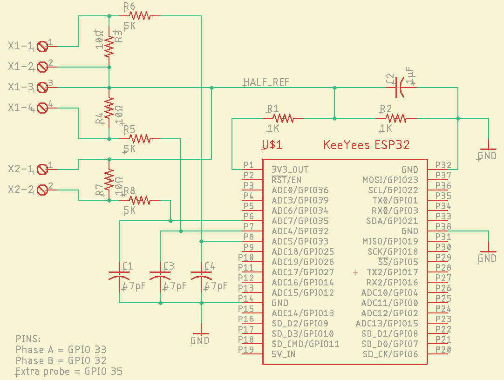
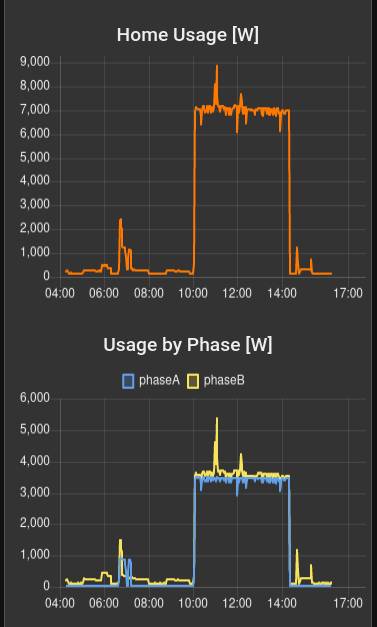

# Home Energy Meter
To satisfy one's curiosity about energy usage in the home (and to get
some practice with small embedded system design), here's a simple and 
inexpensive meter. It measures current in two phases of a US style
split-phase 120/240 volt home electrical system, with an option to
measure current in a third circuit. It could also measure current in
two or three branches of any old AC circuit. 

**This page is currently under construction and incomplete.**
**Hopefully the information here will be somewhat helpful anyway.**

The system as implemented uses an ESP32 microcontroller on a typical
inexpensive breakout board; a simple custom printed circuit board; two
or three current transformers; and a Raspberry Pi in the back of a 
closet. 

* The ESP32 microcontroller runs a MicroPython program which measures 
  AC current usage by taking bursts of data quickly and calculating 
  the root-mean-square value with respect to an average reading. 
  The ADC in an ESP32 isn't nearly as accurate as those in most
  microcontrollers, but using the new `machine.ADC.read_uv()` function, 
  a reading may be made which is sufficiently good to help one optimize 
  the energy usage in a home. 
  
  The microcontroller uses its WiFi module to hop onto your home
  network. 

* The custom circuit board is hosted on OSHPark and a link will be made
  available when some problems with OSHPark's project sharing have been
  solved. The project is named "Home Energy Board."  The board provides:

  * Current to voltage converters in the form of precision(ish) 
    resistors; these are large(ish) through-hole resistors

  * Simple passive level shifters which shift the zero-current reading
    to about half the ADC's maximum reading
    
  * Passive RC filtering to get some really bad noise out of the signals
    and prevent aliasing, while letting ugly but real harmonics generated
    by modern circuitry be measured

  * Labeled screw terminals and mounting holes for convenient connections

Rather than the typical BOM and part numbers, I've just put values on the
board because the SMD parts are all size 0805 and fancy stuff like voltage 
and power ratings aren't too critical for these parts. The through-hole
current to voltage resistors are 10Ω 1% which happened to be lying around.
Different values could be used with minor changes to the software. 

* The current transformers which are used to measure the usage are 
  100 amp to 50 mA split-core transformers and were ordered from that
  big web store at: <https://www.amazon.com/gp/product/B09YRBVNZW/>

  I chose to cut off the audio plugs and use screw terminals to connect
  the transformers to the circuit board. Audio plugs are unreliable IMHO.
  
  Transformers which _do not_ have built-in current to voltage resistors
  should be used with this system, so avoid the ones which specify a
  voltage output...although it might be OK to use those and omit the
  current-to-voltage resistors on the circuit board; I haven't tried that.

* The Raspberry Pi runs two programs of interest:

  * The **Mosquitto** MQTT broker runs on the Pi to gather and
    distribute readings from the energy meter and other items. 
    
  * **Node-RED** is used to produce the plots and serve them on a web
    page. 

* The MicroPython program is hosted here.  It began as a test of 
  Firebase™ for home IoT use, but it was found that connecting to an
  existing Raspberry Pi in a closet was a more efficient solution. 
  
  The networking functions `web_up()` and `web_down()` are declared in
  `boot.py` which is a little unusual but it works. The user must create
  a file `mycerts.py` which defines two strings, `ssid` containing the
  name of the local WiFi network and `password` containing the password. 
  Other constants such as the pin numbers, MQTT topics (yes, my home is
  referred to as a Travisty[sic]), and the address of the MQTT server are
  in `main.py`. 

## Dependencies

* The software needs the **micropython-mqtt** library to work: 
  <https://github.com/peterhinch/micropython-mqtt.git>

## Schematic

## Node-RED flow
The flow diagram code will be added to the software in this repository.

## Screenshot
This wouldn't be much of a README without a screenshot, would it?

The image shows an EV being charged as well as smaller loads from 
cooking breakfast and lunch. 

## Warning
Installing the current transformers usually requires opening circuit
breaker panels to access the main wires. **Please do not attempt this** 
**unless you have the proper training and experience with high voltage**
**electrical circuitry.** Being shocked hurts like heck at best (don't ask
how I know) and can be a real inconvenience to your next of kin at 
worst. Burning down one's residence is another possible unpleasant 
consequence. The author has no control over how you use the information 
in this repository and cannot take any responsibility for the 
consequences. All software and other information in this repository is 
supplied as-is and without any warranty of any kind; I cannot and do 
not guarantee the accuracy, safety, or merchantability of any of this 
content, nor has the author evaluated the accuracy, safety, or
merchantability of any of the products used in the project. 
**By using any of this information, you assume any and all risks and all** 
**responsibility caused by such use, and you agree to indemnify and hold**
**harmless the author(s) of all information in this repository.** 

